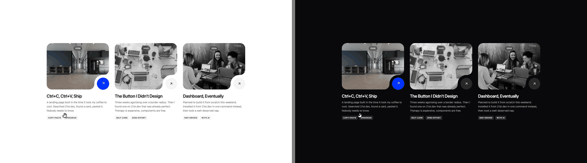

# Notched Project Card

A project card with a rounded notch cut out of its cover, and the arrow sitting in it.



**[View on 21st](https://21st.dev/maudbenaddi/notched-project-card)**

## Install

With the 21st registry (sign in on 21st.dev and use your own API key from
[21st.dev/settings/api-keys](https://21st.dev/settings/api-keys)):

```bash
npx shadcn@latest add "https://21st.dev/r/maudbenaddi/notched-project-card?api_key=YOUR_21ST_API_KEY"
```

Or copy [`notched-project-card.tsx`](notched-project-card.tsx) into `components/ui/`. It needs
`lucide-react` and shadcn's `cn` helper (`@/lib/utils`).

## Usage

```tsx
import { NotchedProjectCard } from "@/components/ui/notched-project-card";

<NotchedProjectCard
  href="/work/checkout"
  title="Ctrl+C, Ctrl+V, Ship"
  description="A landing page built in the time it took my coffee to cool."
  image="https://images.unsplash.com/photo-1497366216548-37526070297c?w=1200&q=80"
  badge="2026"
  tags={["Copy-paste", "Speedrun"]}
  monochrome
/>
```

The full demo, three cards in a grid, is in [`demo.tsx`](demo.tsx).

## Props

| Prop | Type | Default | What it does |
|---|---|---|---|
| `href` | `string` | required | Where the card goes |
| `title` | `string` | required | The card's title |
| `description` | `string` | | A line or two under the title |
| `image` | `string` | required | The cover photo |
| `imageAlt` | `string` | `""` | Text alternative for the cover |
| `badge` | `string` | | A pill at the top of the cover, e.g. the year |
| `tags` | `string[]` | `[]` | Small labels under the text |
| `screen` | `{ src, alt, className? }` | | A product screen over the photo; it grows on hover while the photo holds still |
| `dim` | `number` | `0.45` with a screen, else `0` | A dark wash between the photo and the screen, 0 to 1 |
| `monochrome` | `boolean` | `false` | Cover in black and white, colour back on hover or focus |
| `surface` | `string` | `var(--color-background)` | The colour behind the card; the notch is painted in it |
| `accent` | `string` | theme primary | The arrow disc's fill on hover |
| `accentForeground` | `string` | `#0a0a0a` | The arrow's colour on that fill |
| `className` | `string` | | Extra classes on the card |

## Accessibility

- The whole card is one link, so it is a single stop with Tab and opens with Enter.
- A visible focus ring shows where the keyboard is, and a monochrome cover takes its
  colours back on focus as well as on hover.
- The notch and the arrow are decorative and hidden from screen readers, which read the
  link as its title and description. Give `imageAlt` (or `screen.alt`) when the picture
  says something the text does not.
- Colours come from the shadcn theme tokens, so the card follows light and dark.
- Hover effects are short scale and colour transitions. They don't switch off for
  reduced motion yet.

## Licence

MIT licence. Made by [Maud](https://21st.dev/maudbenaddi).
